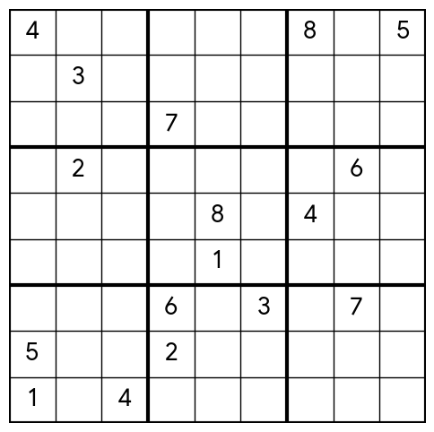
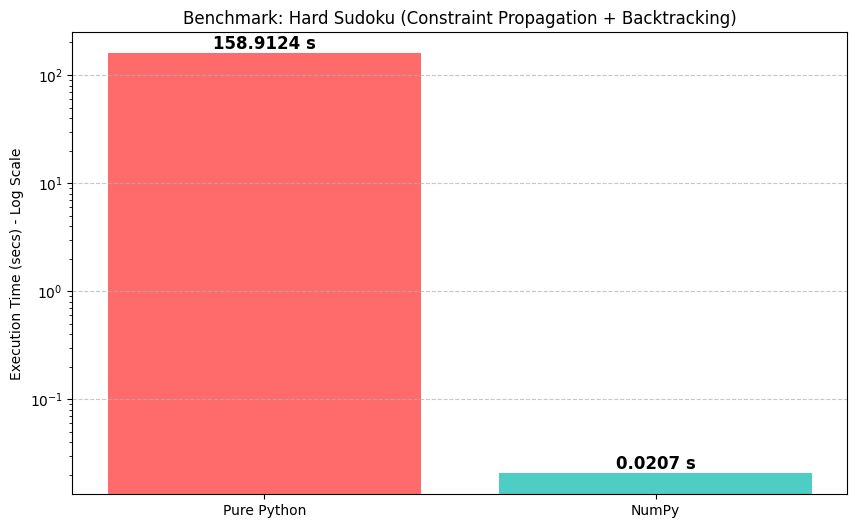

# Vectorized Sudoku Solver (CSP)

[](https://www.python.org/)

[](https://opensource.org/licenses/MIT)

A comparative study and implementation of Sudoku solvers modeled as **Constraint Satisfaction Problems (CSP)**. 

This project demonstrates the massive impact of data structure selection on computational performance, achieving a **~7000x speedup** by refactoring a classic symbolic backtracking algorithm into a vectorized NumPy approach.


## 🧠 The Approaches

This repository implements and benchmarks two versions of the same Constraint Propagation algorithm with Backtracking and MRV (Minimum Remaining Values) heuristic:


### 1. Pure Python (Symbolic)
* **Data Structure:** Dictionaries mapping coordinates (e.g., `'A1'`) to strings of possible values (e.g., `'1245'`).
* **Logic:** Graph-based peer elimination using sets and string manipulation.
* **Pros:** High code readability, easy to understand the graph theory behind Sudoku.
* **Cons:** High interpreter overhead, object creation costs, and lack of memory locality.


### 2. NumPy (Vectorized)
* **Data Structure:** A 3D Boolean Tensor of shape `(9, 9, 9)`.
    * Axes 0 & 1: Board rows and columns.
    * Axis 2: **One-Hot Encoding** of possible digits (Depth).
* **Logic:** Vectorized bitwise operations and C-level linear algebra routines.
* **Pros:** Massive performance gain due to cache locality and contiguous memory blocks.


## 🔍 How it Works

Instead of iterating over peers one by one, the NumPy implementation uses the 3rd dimension of the tensor to perform elimination in parallel.

1. **State:** `grid[i, j, :]` is a boolean array of size 9 representing candidates for cell .
2. **Elimination:** When a cell is solved (e.g., digit 5), we set `grid[peers, 4] = False` (index 4 represents digit 5) in a single slice operation.
3. **MRV Heuristic:** `np.argmin(np.sum(grid, axis=2))` instantly finds the cell with the fewest candidates.


## 🚀 Benchmark Results

Tested on "Hard" difficulty Sudoku puzzles that require deep backtracking trees, like the one below:


The graph below visualizes the execution time difference. Note the **Log Scale** on the Y-axis; without it, the NumPy execution time would be invisible due to the magnitude of the speedup.



| Implementation | Execution Time (Hard Puzzle) | Speedup |
| :--- | :--- | :--- |
| **Pure Python** | ~158.91 seconds | 1x |
| **NumPy** | **~0.02 seconds** | **~7665x** |

*Note: Results may vary depending on hardware, but the order of magnitude remains consistent.*

## 🛠️ Installation

1. Clone the repository:
    ```bash
    git clone https://github.com/vitor-rodovalho/numpy-sudoku-solver.git
    ```

2. Install the required dependencies (if needed):
    ```bash
    pip install numpy matplotlib 
    ```
3. **Run the Notebook:**
Open the `.ipynb` file in Jupyter or Google Colab to see the step-by-step implementation and the benchmark visualization.


---

## ⚠️ Language Note

Please note that the code comments are currently in **Portuguese**, as this project was originally developed for a university assignment.

## 📄 Author

Developed by **Vitor Hugo Rodovalho**.


---

**License**: MIT License
